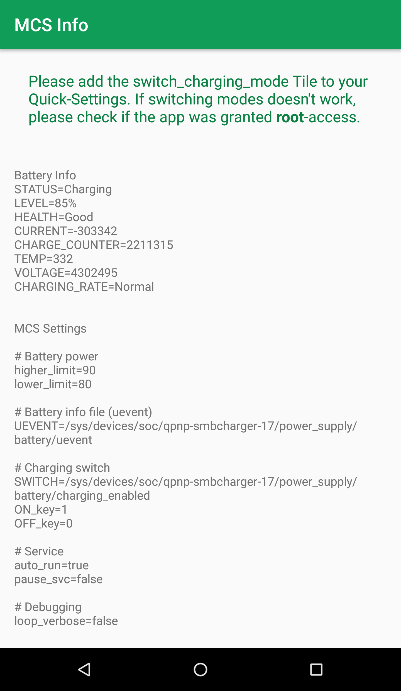
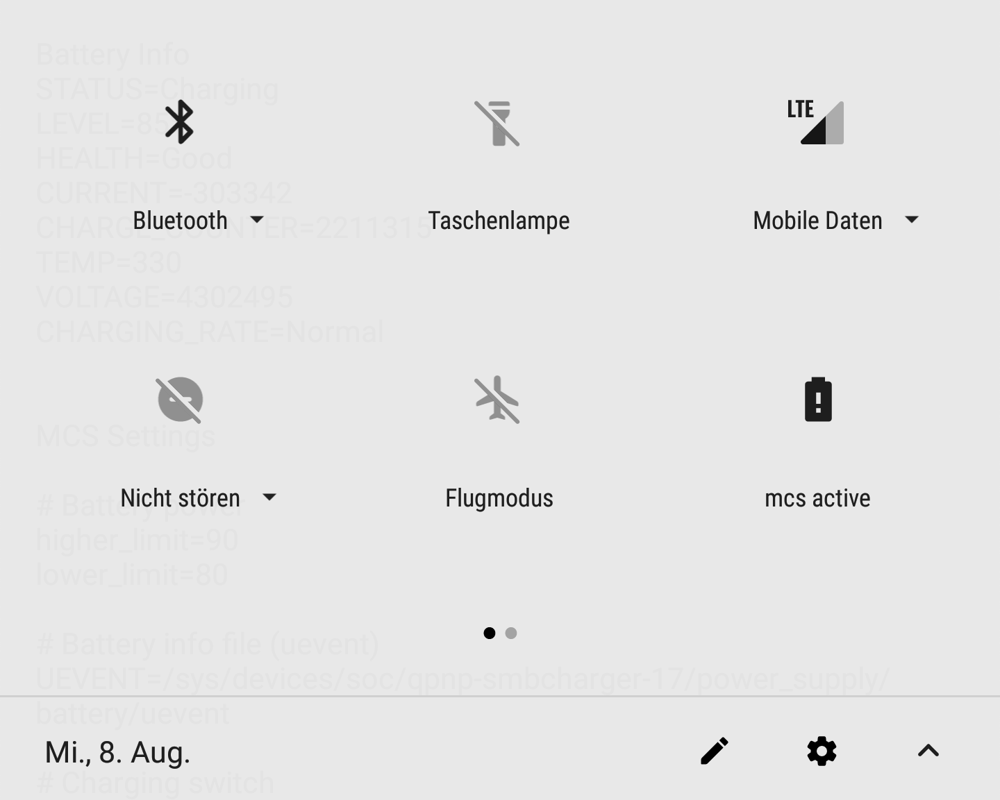
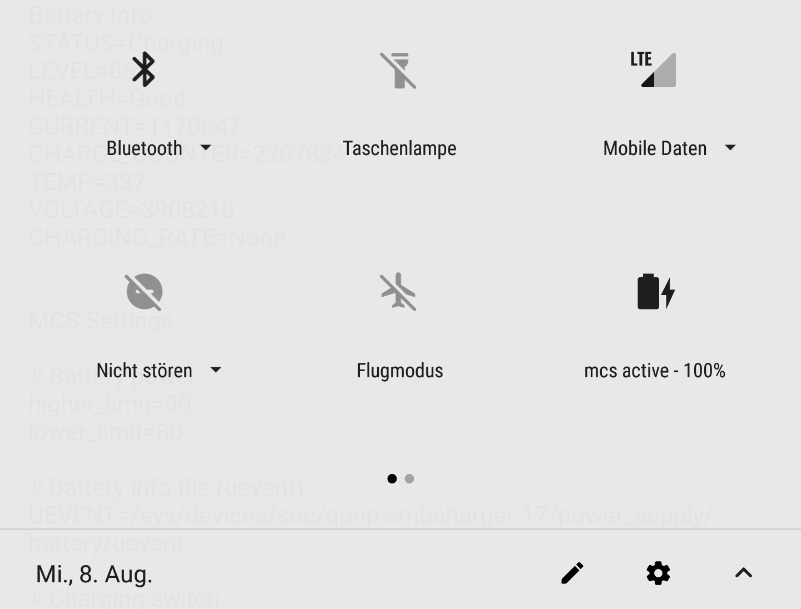

# MCS Info, or Horrible Hack based on the Android N Quick Settings Codelab

(mostly relevant for Moto Z... users)

I'm using mcs for "efficency-mode"
In the default settings mcs will charge the battery if its lower than 80% and only up to 90% charge.

https://github.com/Magisk-Modules-Repo/Magic-Charging-Switch

This is a small app to make using it more pleasant.

It has a main-view that will show the battery and service status of mcs.

And a tile to toggle the mcs-state. 

* normal tile means that mcs is active
* tile greyed out means that normal charging is enabled

This tile will also show the charge of my Incipio Battery Mod when its connected. 
When the mod is charging the battery the icon will change accordingly.

Long pressing the tile will open the main app.

## Features
* show MCS and Battery Info
* tile: toggle mcs-active / charging
* tile: show mod charge
* tile: show whether the mod is charging the battery
* tile: long press to open main app

## Needs
* mcs installed https://github.com/Magisk-Modules-Repo/Magic-Charging-Switch
* root

## Screenshots:




## Bugs
* Will crash when no root access is given (I will probably never fix that)

## Ideas:
* https://stackoverflow.com/questions/24532934/checking-battery-level-in-the-background-with-a-service?rq=1
* https://developer.android.com/training/monitoring-device-state/battery-monitoring.html

---

This folder contains the source code for a [Google I/O 2016 codelab on Android N Quick Settings](https://codelabs.developers.google.com/codelabs/android-n-quick-settings/#0).


### License of Android N Quick Settings Codelab

```
Copyright 2016 Google, Inc.

Licensed to the Apache Software Foundation (ASF) under one or more contributor
license agreements. See the NOTICE file distributed with this work for
additional information regarding copyright ownership. The ASF licenses this
file to you under the Apache License, Version 2.0 (the "License"); you may not
use this file except in compliance with the License. You may obtain a copy of
the License at

http://www.apache.org/licenses/LICENSE-2.0

Unless required by applicable law or agreed to in writing, software
distributed under the License is distributed on an "AS IS" BASIS, WITHOUT
WARRANTIES OR CONDITIONS OF ANY KIND, either express or implied. See the
License for the specific language governing permissions and limitations under
the License.
```
